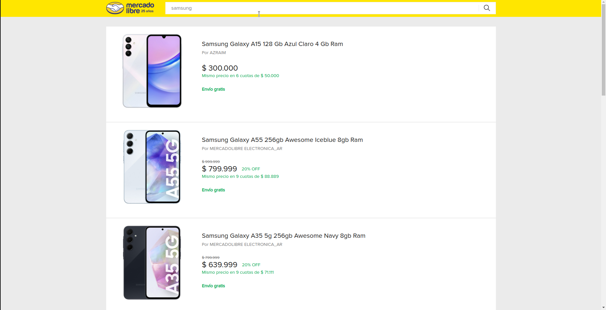
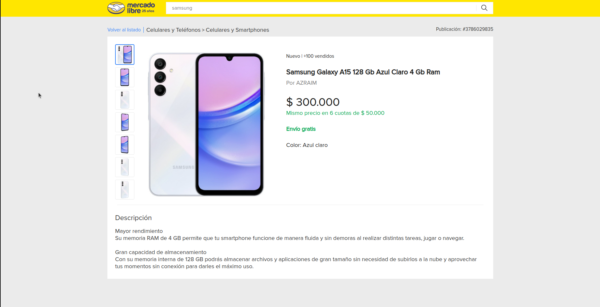

# Desafío Shops
Prueba técnica para aspirantes al área de Frontend de Mercado Libre.

## Instrucciones
1. Sobre la carpeta raíz del directorio, moverse a la carpeta del servidor

&nbsp;&nbsp;&nbsp;&nbsp;&nbsp;&nbsp;&nbsp;&nbsp;&nbsp;&nbsp;&nbsp;&nbsp;&nbsp;&nbsp;&nbsp;&nbsp;&nbsp;&nbsp;`cd server/`

2. Correr el servidor desde la carpeta /server

&nbsp;&nbsp;&nbsp;&nbsp;&nbsp;&nbsp;&nbsp;&nbsp;&nbsp;&nbsp;&nbsp;&nbsp;&nbsp;&nbsp;&nbsp;&nbsp;&nbsp;&nbsp;`npm start`

3. En otra terminal, compilar la aplicación Frontend desde la carpeta raíz.

&nbsp;&nbsp;&nbsp;&nbsp;&nbsp;&nbsp;&nbsp;&nbsp;&nbsp;&nbsp;&nbsp;&nbsp;&nbsp;&nbsp;&nbsp;&nbsp;&nbsp;&nbsp;`npm start`

## Componentes
- **SearchBar:** Se encarga de renderizar la barra de búsqueda y almacenar el término usado en la página de listado de productos.

- **ProductListPage:** Se encarga de renderizar el listado de productos por medio de componentes `Shelf`, que se encarga de renderizar cada elemento de la vitrina de producto del listado haciendo llamado a uno de los endpoints del servidor (`/api/items?offset=:offset&q=​:query`).

- **ProductDetailPage:** Se encarga de renderizar todos los datos de la página de detalle de producto haciendo uso del consumo de uno de los enpoints del servidor(`/api/items/​:id`). Dentro de él encontramos el componente `Breadcrumb` que se encarga de renderizar la miga de pan. Y `Gallery` que se encarga de renderizar las imágenes de producto.

## Consideraciones
Algunos parámetros no pueden ser obtenidos desde la respectiva apicall por lo que se almacenaron en el servidor haciendo uso los llamados del flujo en ejecución.

Estos parámetros son:

- **Seller:** nombre del vendedor en PDP.
- **Installments:** información sobre cuotas en PDP.
